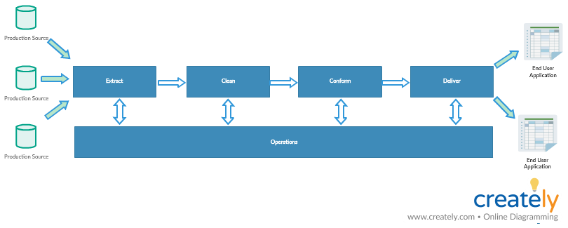
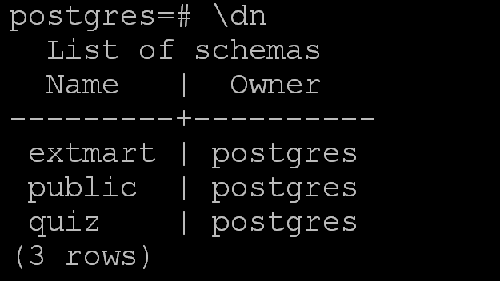
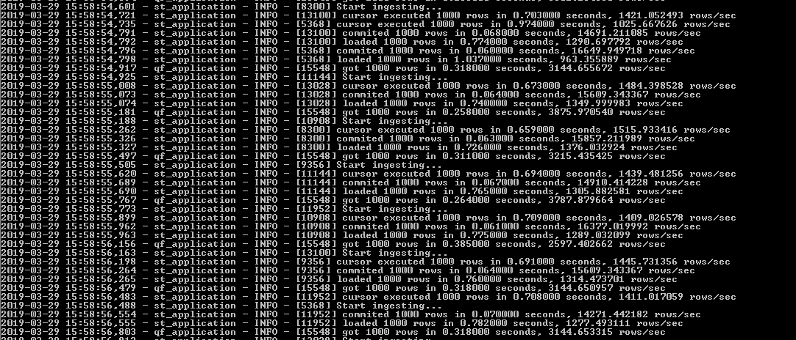

# pysdtt - python simple data transfer tool

Which is able to transfer data from any (almost) sources to postgresql.
It may be useful while data warehousing :)
## Features:
* Load data from any sql source with pandas back-end. It may be useful for simple and fast getting data.
`Not recommend` to use this mode in production pipeline.
* Load data from `MSSQL`, `POSTGRESSQL` and `MONGODB` in `row-by-row` mode. This mode may be convenient while debugging.
That's fairly slow so it's not suited for production environment.
* Load data from `MSSQL`, `POSTGRESSQL` and `MONGODB` in `multi` mode. This is pretty fast mode, which use `MULTIPROCESSING` 
and it consumes very few memory.
* Logging data loading process with information about speed of loading
* SQL (simple text) and MongoDB (yaml) query support
* Automatic table creation
* Automatic new column detection (config file) and its creation
* Handling `JSON data`
* Easy task start from a command prompt
* Integration with `Apache Airflow` 
* 3 options how to behave if the table already exists

|Option| Behaviour |
|--- |--- |
|fail| Raise a ValueError
|replace| Drop the table before inserting new values.
|append| Insert new values to the existing table.

## Introduction
`The Extract-Transform-Load (ETL) system` is the foundation of the data warehouse.
it consumes 80 percent of the resources needed for implementation and maintenance
of typical data warehouse.

`The mission of the data warehouse` is to publish the organization's data assets to most effectively support
decision making. The key word in this mission statement is publish.

`Data warehousing` is the process of taking data from legacy and transaction database systems and
transforming it into organized information in a user-friendly format to encourage data analysis and 
support fact-based business decision-making.

`A data warehouse` is a system that extracts, cleans, conforms, and delivers source data into a 
dimensional data store and then supports and implements querying and analysis for the purpose of 
decision making.

DWH is not:
* a product
* a language
* a project
* a data model
* a copy of transaction system 

### ETL system:
* Removes mistakes and corrects missing data
* Provides documented measures of confidence data
* Captures the flow of transactional data for safekeeping
* Adjusts data from multiple sources to be used together
* Structures data to be usable by end-users tools

### ETL threads
* Planning & Design
* Data Flow

## **Planning & Design**

#### Requirements and Realities:
* Business needs
* Data Profiling and other data-source realities
* Compliance requirements
* Security requirements
* Data integration
* Data latency
* Archiving and lineage
* End user delivery interfaces
* Available development skills
* Available management skills
* Legacy licenses

#### Architecture:
* Hand-coded versus ETL vendor tool
* Batch versus streaming data flow
* Horizontal versus vertical task dependency
* Sheduler automation
* Exception handling
* Quiality handling
* Recovery and restart
* Metadata
* Security

#### System Implementation:
* Hardware
* Software
* Coding practices
* Documentation practices
* Specific quality check

#### Test & Release:
* Development system
* Test systems
* Production systems
* Handoff procedures
* Update propagation approach
* System snapshoting and rollback procedures
* Performance tuning

## **Data Flow**

#### Extract:
* Reading source-data models
* Connecting to and accessing data
* Scheduling the source system, intercepting notifications and daemons
* Capturing changed data
* Staging the extracted data to disk

#### Clean:
* Enforcing column properties
* Enforcing structure
* Enforcing data and value rules
* Enforcing complex business rules
* Building a metadata foundation to describe data quality
* Staging the cleaned data to DWH/disk

#### Conform:
* Conforming business labels (in dimensions)
* Conforming business metrics and perfomance indicators (in fact tables)
* Deduplicating
* Householding
* Internationalizing
* Staging the conformed data to DWH/disk

#### Data delivery:
* Loading flat and snowflaked dimensions
* Generating time dimensions
* Loading degenerate dimension
* Loading subdimensions
* Loading types 1,2 and 3 slowly changing dimensions
* Conforming dimensions and conforming facts
* Handle late-arriving dimensions and late arriving facts
* Loading multi-valued dimensions
* Loading ragged hierarchy dimensions
* Loading text fact in dimensions
* Running the surrogate key pipeline for fact tables
* Loading three fundamental fact table grains
* Loading and updating aggregations
* Staging the delivered data to DWH/disk

#### Operations:
* Scheduling
* Job execution
* Exception handling
* Recovery and restart
* Quality checking
* Release
* Support

## The mission of the ETL team
* Deliver data most effectively to end user tools
* Add value to data in the cleaning and conforming steps
* Protect and document the lineage of data

## Designing the Staging Area
* The data-staging area must be owned by the ETL team
* Users are not allowed in the staging area for any reason
* Report cannot access data from the staging area
* Only ETL process can write to and read from the staging area

#### Staging table volumetric worksheet (example)
| Table Name| Update Strategy| Load Frequency| ETL Job(s)| Initial Rowcount| Avg Row Length| Grows with| Expected Monthly Rows |Expected Monthly Bytes| Initial Table Size Bytes| Table Size 6 mo.(MB)
|:--- |--- |---|---|---|---|---|---|---|---|---
|S_ACCOUNT| Replace| D |SAccount| 39633| 27| New accounts| 9983| 269548|1078191|2.57 
|S_CUSTOMER| Append| D| SCustomer|38103|142|New customers| 9526|1352657|5410626|12.9
|S_PRODUCT| Replace| On Demand| SProduct| 174641|73| New products| 43660|3187198|12748793|30.40

* `Table name` - the name of the table or file in the staging area. There is one row in the worksheet for each staging table
* `Update Strategy` - this field indicates how the table is maintained. If it is a persistent staging table , it will
have data appended, updated, and perhaps deleted. Transient staging tables are truncated and reloaded with each process.
* `Load Frequency` - reveals how often the table is loaded or changed by the ETL process. It can be weekly, monthly, or
any interval of time. In a real-time environment, tables in the staging area can be updated continuously.
* `ETL Job(s)` - staging tables are populated or updated via ETL jobs. The ETL job is the job or program that affects
the staging table or file. When many jobs affect a single staging table, list all of the jobs in this section of the worksheet.
* `Initial Row Count` - the ETL team must estimate how many rows each table in the staging area initially contains.
The initial row count is usually based on the rows in the source and/or target tables
* `Average Row Length` - for size estimation purposes, you must supply the DBA with the average row length in each staging table.
* `Grows with` - even though tables are updated on a scheduled interval, they don't necessarily grow each time the are touched.
The `Grows With` field is based on business rules. You must define when each table in the staging area grows.
For example, a status table grows each time a new status is added. Even though the table is touched daily to look for
changes , the addition of new status is quite rare.
* `Expected Monthly Rows` - this esimate is based on history and business rules. Anticipated growth is required
for the DBA to allocate approriate space to the table. The monthly row count is a building block to
calculate how many bytes the table grows each month
* `Expected Monthly Bytes` - expected `Monthly Bytes` is a calculation of Average Row Length times `Expected Monthly Rows` 
* `Initial Table Size` - the initial table size is usually represented in bytes or megabytes. It is calculation of
`Average Row Length` times `Initial Row Count`
* `Table Size 6 Months` - an estimation of table  sizes after six months of activity helps DBA to estimate how the
staging table grows. It is a calculation of
(`Average Row Length` * `Initial Row Count`)  + (`Average Row Length` * `Expected Monthly Bytes` * 6)/1048576

#### The logical Data Map
* Have a plan
* Identify data sources candidates
* Analyze source systems with data-profiling tool
* Receive walk-though of data lineage and business rules:
  - required alterations to the data during the data-cleaning steps
  - coercions to dimensional attributes and measured numerical facts to achieve standard conformance across separate data
  sources
* Receive walk-though of data warehouse data model
* Validate calculations and formulas

| Target Table Name| Target Column Name| Target Data Type| Target Table Type| SCD Type| Source MS/Database Name| Source Table Name| Source Column Name |Source Data Type| Transformation|
|:--- |--- |---|---|---|---|---|---|---|---
|EMPLOYEE_DIM| EMPLOYEE_KEY| NUMBER| Dimension| 1| | |  | | Surrogate key
|EMPLOYEE_DIM| EMPLOYEE_ID| NUMBER| Dimension| 1| HR_SYS| EMPLOYEES| EMPLOYEE_ID | NUMBER| Natural key for employee in HR system
|EMPLOYEE_DIM| BIRTH_DATE| DATE| Dimension| 1| HR_SYS| EMPLOYEES| BD | Date| Put sql here
|EMPLOYEE_CONTRACT_FACT| EFFECTIVE_DATE_KEY| NUMBER| Fact| N/A| DW_PROD, HR_SYS| DATE_DIM, EMPLOYEE_CONTRACT| DATE_KEY| NUMBER| where employee_contract.date =dw_prod.date_dim.date
|EMPLOYEE_CONTRACT_FACT| END_DATE_KEY| NUMBER| Fact| N/A| DW_PROD, HR_SYS| DATE_DIM, EMPLOYEE_CONTRACT| DATE_KEY| NUMBER| where employee_contract.end_date =dw_prod.date_dim.date
|EMPLOYEE_CONTRACT_FACT| PROJECT_KEY| NUMBER| Fact| N/A| DW_PROD, HR_SYS| PROJECT_DIM, EMPLOYEE_CONTRACT| PROJECT_KEY| NUMBER| where employee_contract.project_code =dw_prod.project_dim.project_code
|EMPLOYEE_CONTRACT_FACT| RATE_AMOUNT| NUMBER| Fact| N/A| DW_PROD, HR_SYS| PROJECT_DIM, EMPLOYEE_CONTRACT| AMOUNT| NUMBER| sum(amount)

* `Target table name` - the physical name of the table as it appears in the data warehouse
* `Target column name` - the name of the column in the data warehouse table
* `Table type` - indicates if the table is a fact, dimension, or subdimension (outrigger)
* `SCD (slowly changing dimension) type` - for dimensions, this component indicates a Type-1, -2 or -3 slowly 
changed dimensions approach. This indicator can vary for each column in the dimension. For example, within the 
customer dimension, the last name may require Type 2 behaviour (retain history), while the first name may require
Type 1 (overwrite)
* `Source MS/Database Name` - the name of the micro-service/instance of the database where the source data resides.
It can be the connect string required to connect to the database. It can also be the name of a file as it appears
in the file systems. In this case, the path of the file would also be included.
* `Source table name` -  the name of the table where the source data originates. There will be many cases where more
than one table is required. In those cases, simply list all tables required to populate the relative table in the target
data warehouse
* `Source column name` - the column or columns necessary to populate the target. Simply list all of the columns required
to load the target column.
* `Transformation` - the exact manipulation required of the source data so it corresponds to the expected format of the 
target. This component is may be notated in SQL or pseudo-code

#### Source system tracking report
 
## Usage
* wright sql query and put it into query folder as .sql file
* fill the `config/config.yaml` up for a source db in the source_name section
* fill the `config/config.yaml` up for a sink db in the sink_name section
* run `python etl.py --from your_source_name --to your_sink_name --mode multi`
* check `logs/info.log` and `logs/errors.log`

## Use cases
### From mssql to postgresql

`Our goal` - to connect to microservice which we will call `QUIZ`. This microservice use `MS SQL` as RDBMS.
The database has the table `qf_application`, which contains
information about applications. We have to extract data from ms and ingest it into our staging layer. 

#### the table structure
|field | type
|---|---
|id| int
|id_form| int
|uuid| nvarchar(50)
|status| nvarchar(50)
|description| nvarchar(250)
|extra| varchar(250)
|created_at| datetime2(6)
|updated_at| datetime2(6)
|title| nvarchar(250)
|weight| int
|channel| nvarchar(50)
|regno| nvarchar(50)
|city| nvarchar(250)

The field `extra` contains string representation of json.

* Firstly prepare staging layer. We need to connect to postgresql using superuser role
    
    `psql -U postgres`
* Create schema for raw data from ms `QUIZ`

    `CREATE SCHEMA IF NOT EXISTS quiz;`
* Check it

    `\dn`
    
        
* Create a table which will have information about accesses

      CREATE TABLE quiz.quiz_access (
      id serial NOT NULL,
      "schema" varchar NOT NULL DEFAULT 'quiz'::character varying,
      "table" varchar NOT NULL,
      creator varchar NOT NULL,
      created_at timestamp NOT NULL DEFAULT CURRENT_TIMESTAMP,
      "role" varchar NOT NULL,
      role_psw varchar NOT NULL,
      "sql" varchar NULL,
      "comment" varchar NULL
        );
     
* Check it

     `\d quiz.quiz_access`
     
* Create role `etl_quiz_admin`

     
         CREATE ROLE etl_quiz_admin WITH LOGIN PASSWORD '2r3qs9AVDysM4zHU'
         NOSUPERUSER INHERIT NOCREATEDB NOCREATEROLE NOREPLICATION VALID UNTIL 'infinity';
         GRANT CONNECT ON DATABASE postgres TO etl_quiz_admin;
         GRANT USAGE ON SCHEMA quiz TO etl_quiz_admin;
         GRANT ALL PRIVILEGES ON ALL TABLES IN SCHEMA quiz TO etl_quiz_admin;
         GRANT USAGE, SELECT ON ALL SEQUENCES IN SCHEMA quiz TO etl_quiz_admin;
         GRANT CREATE ON SCHEMA quiz TO etl_quiz_admin;

* Check it

    `\dg`
    
* Add a record

    
        insert into quiz.quiz_access(
        "schema",
        "table",
        creator,
        "role",
        role_psw,
        "sql")
        values (
        'quiz',
        'all',
        'mail@domen.com',
        'etl_quiz_admin',
        '2r3qs9AVDysM4zHU ',
        'CREATE ROLE etl_quiz_admin WITH LOGIN PASSWORD ''2r3qs9AVDysM4zHU''
        NOSUPERUSER INHERIT NOCREATEDB NOCREATEROLE NOREPLICATION VALID UNTIL ''infinity'';
        GRANT CONNECT ON DATABASE postgres TO etl_quiz_admin;
        GRANT USAGE ON SCHEMA quiz TO etl_quiz_admin;
        GRANT ALL PRIVILEGES ON ALL TABLES IN SCHEMA quiz TO etl_quiz_admin;
        GRANT USAGE, SELECT ON ALL SEQUENCES IN SCHEMA quiz TO etl_quiz_admin;
        GRANT CREATE ON SCHEMA quiz TO etl_quiz_admin;'
        );
    
* Check it

    `select * from quiz.quiz_access;`
   
* Create a file `quiz.yaml` in the `configs` folder
* Create a folder `quiz` in the folder `query`
* Create a file `qf_application.sql` in the folder `quiz`
* Add the lines to `qf_application.sql` and save your changes
    
    
        select
            id,
            id_form,
            uuid,
            status,
            description,
            extra,
            created_at,
            updated_at,
            title,
            weight,
            channel,
            regno,
            city
        from
            qf_application

      
* Add the lines to the file `configs/quiz.yaml`

        source_name:
          qf_application:
            type: mssql+pymssql
            host: yourSourceHostDB
            port: yourSourcePortDB
            dbname: yourSourceDBname
            user: yourSourceUsername
            psw: yourSourcePSW
            file: query/quiz/qf_application.sql
            cursor_size: 1000
        sink_name:
            st_application:
            type: postgresql+psycopg2
            host: yourSinkHostDB
            port: yourSinkPortDB
            dbname: yourSinkDBName
            schema: quiz
            user: etl_quiz_admin
            psw: 2r3qs9AVDysM4zHU
            table: st_application
            if_exists: replace
            method: multi
            dtypes:
                id: int
                id_form: int
                uuid: varchar(64)
                status: varchar(64)
                description: varchar(255)
                extra: json
                created_at : timestamp
                updated_at: timestamp
                title: varchar(255)
                weight: int
                channel: varchar(255)
                regno: varchar(64)
                city: varchar(255)
          

* Create a file `st_application.cmd`  in `runnners` folder

        echo "Start ETL process from ms quiz.qf_application to quiz.st_application in multi mode"
        cd ..\..
        C:\ProgramData\Anaconda3\python.exe etl.py --conf configs/quiz.yaml --from qf_application --to st_application --mode multi
    
* Run it

  

### Using extensions

Creating a schema to contain all extensions
    
    create schema extensions;
    
    -- make sure everybody can use everything in the extensions schema
    grant usage on schema extensions to public;
    grant execute on all functions in schema extensions to public;
    
    -- include future extensions
    alter default privileges in schema extensions
       grant execute on functions to public;
    
    alter default privileges in schema extensions
       grant usage on types to public;
       
Now install the extension:

    create extension unaccent schema extensions;
    
### Sorting data in PostgreSQL

The work_mem parameter is by default set to 4 MB

    SHOW work_mem;
    
work_mem tells the server that up to 4 MB can be used per operation (per sort, grouping operation, etc.).
If you sort too much data, PostgreSQL has to move the excessive amount of data to disk, 
which is of course slow.  

The easiest way to change work_mem on the fly is to use SET 

    SET work_mem TO '1 GB';
    
If you want to speed up and tune sorting in PostgreSQL, there is no way of doing that without changing work_mem.
The work_mem parameter is THE most important knob you have.
The cool thing is that work_mem is not only used to speed up sorts 
– it will also have a positive impact on aggregations and so on.

As of PostgreSQL 10 there are 3 types of sort algorithms in PostgreSQL:
* external sort Disk
* quicksort
* top-N heapsort

“top-N heapsort” is used if you only want a couple of sorted rows. 
For example: The highest 10 values, the lowest 10 values and so on.
“top-N heapsort” is pretty efficient and returns the desired data in almost no time.

work_mem is ideal to speed up sorts. However, in many cases it can make sense to avoid sorting in the first place.
Indexes are a good way to provide the database engine with “sorted input”.
In fact: A btree is somewhat similar to a sorted list.
Building indexes (btrees) will also require some sorting.
Many years ago PostgreSQL used work_mem to tell the CREATE INDEX command, 
how much memory to use for index creation. This is not the case anymore: In modern versions of PostgreSQL 
the maintenance_work_mem parameter will tell DDLs how much memory to use.
Here is an example:

    test=# \timing
    Timing is on.
    test=# CREATE INDEX idx_x ON t_test (x);
    CREATE INDEX
    Time: 4648.530 ms (00:04.649)
    
The default setting for maintenance_work_mem is 64 MB, but this can of course be changed:

    test=# SET maintenance_work_mem TO '1 GB';
    SET
    Time: 0.469 ms
    
The index creation will be considerably faster with more memory:

     test=# CREATE INDEX idx_x2 ON t_test (x);
     CREATE INDEX
     Time: 3083.661 ms (00:03.084)
     
In this case CREATE INDEX can use up to 1 GB of RAM to sort the data, which is of course a lot faster than going to disk.
This is especially useful if you want to create large indexes.

##### Sorting in PostgreSQL and tablespaces
Many people out there are using tablespaces to scale I/O. By default PostgreSQL only uses a single tablespace,
which can easily turn into a bottleneck. Tablespaces are a good way to provide PostgreSQL with more hardware.
Let us assume you have to sort a lot of data repeatedly: The temp_tablespaces is a parameter, which allows
administrators to control the location of temporary files sent to disk. Using a separate tablespace for temporary
files can also help to speed up sorting.
If you are not sure how to configure work_mem,
consider checking out http://pgconfigurator.cybertec.at – it is an easy tool helping people to configure PostgreSQL.

## TODO
* add csv support
* ~~add mongodb support~~
*   It might be more convinient use in config the following schema defining the types:

        int4:
            col1
            col2
            col3
        varchar(64):
            col1
            col2
            col3

* ~~handle bug in multi mode, add error message when cursor_size is not specified~~

## Inside
<ul>
<li>Prototype - base class</li>
    <ul>
        <li>Batch loading (based on pandas) uses together the following classes:</li>
            <ul>
            <li>Source class</li>
                <ol>
                    <li> can use all sources available for SQLAlchemy</li>
                    <li> usefull for small data</li>
                    <li> specify date_column field in the congif.yaml if result of query execution contains timestamp fields  </li>
                </ol>
            <li>Sink   class</li>
                <ol>
                <li> can use all sinks   available for SQLAlchemy</li>
                <li> usefull for small data</li>
                </ol>
            </ul>
            </ul>
            <ul>
        <li>Parallel loading (as for sink only postgres is available) uses together the following classes:</li>
            <ul>
                <li>Producer class</li>
                <li>Sink   class</li>
                </ul>
            </ul>
</ul>

### Config description

    source_name:
        test_source2:
            type: postgresql+psycopg2
            host: 172.18.151.27
            port: 5432
            dbname: postgres
            schema: upload
            user: superset
            psw: password
            file: query/file.sql

* source_name - section name, can't be changed
* test_source - source pseudonym, used in the command prompt
* type - type db, see also SQLAlchemy
* file - file containing query to db
* cursor_size - number of rows transmitted to insertion in one commitment (mode = row_by_row or multiprocessing]

### Command prompt
mode:
* all_data, will be used pandas as backend, doesn't work when source is mongodb
* row_by_row,  will consume small batch from db cursor and load it into sink (specify cursor_size in the source_name section). This allows you to process unlimited or unknown amounts of data with a fixed amount of memory.
* multi, the same as row_by_row, but much faster

### Notice
UUID stands for Universal Unique Identifier defined by RFC 4122 and other
related standards. A UUID value is 128-bit quantity generated by an
algorithm that make it unique in the known universe using the same algorithm

Because of its uniqueness feature, you often found UUID in the distributed
systems because it guarantees a better uniqueness than the `SERIAL` data
type which generates only unique values within a single database.

PostgreSQL allows you store and compare UUID values but it does not
include functions for generating the UUID values in its core.
Instead, it relies on the third-party modules that provide specific
algorithms to generate UUIDs. For example the uuid-ossp module provides
some handy functions that implement standard algorithms for generating UUIDs.

To install the uuid-ossp module, you use the CREATE EXTENSION statement as follows:

`CREATE EXTENSION IF NOT EXISTS "uuid-ossp";`

The `IF NOT EXISTS` clause allows you to avoid re-installing the module.

It's important because there is uuid generator is being used.
If you don't have the opportunity to create extension you should
replace uuid_generate_v1() by serial

### Notice

There are two JSON data types: json and jsonb. They accept almost
identical sets of values as input. The major practical difference is one
of efficiency. The json data type stores an exact copy of the input text,
which processing functions must reparse on each execution
while jsonb data is stored in a decomposed binary format that makes it slightly
slower to input due to added conversion overhead, but significantly faster
to process, since no reparsing is needed. jsonb also supports indexing,
which can be a significant advantage.

Because the json type stores an exact copy of the input text,
it will preserve semantically-insignificant white space between tokens,
as well as the order of keys within JSON objects.
Also, if a JSON object within the value contains the same key more than
once, all the key/value pairs are kept.
(The processing functions consider the last value as the operative one.)
By contrast, jsonb does not preserve white space,
does not preserve the order of object keys,
and does not keep duplicate object keys.
If duplicate keys are specified in the input, only the last value is kept.

### Challenges with writing Custom ETL scripts to move data from MongoDB to PostgreSQL:
   1. Schema detection cannot be done up front
   Unlike a relational database, a MongoDB collection doesn’t have a predefined schema.
   Hence, it is impossible to look at a collection and create a compatible table in PostgreSQL upfront.

   2. Different documents in a single collection can have a different set of fields
   A document in a collection in MongoDB can have a different set of fields. 

     {

        "name": "John Doe",

        "age": 32,

        "gender": "Male"

    }

    {

        "first_name": "John",

        "last_name": "Doe",

        "age": 32,

        "gender": "Male"

    }

   3. Different documents in a single collection can have incompatible field data types
   Hence, the schema of the collection cannot be determined by reading one or a few documents.

   Two documents in a single MongoDB collection can have fields with values of different types.

    {

        "name": "John Doe",

        "age": 32,

        "gender": "Male"

        "mobile": "(424) 226-6998"

    }
   and

    {
        "name": "John Doe",

        "age": 32,

        "gender": "Male",

        "mobile": 4242266998

    }
   The field mobile is a string and a number in the above documents respectively.
   It is a completely valid state in MongoDB. In PostgreSQL, however, both these values
   either will have to be converted to a string or a number before being persisted.

   4. New fields can be added to a document at any point in time
   It is possible to add columns to a document in MongoDB by running a simple update
   to the document. In PostgreSQL, however, the process is harder as you have to construct
   and run ALTER statements each time a new field is detected.

   5. Character lengths of String columns
   MongoDB doesn’t put a limit on the length of the string columns.
   It has a 16MB limit on the size of the entire document.
   However, in PostgreSQL, it is a common practice to restrict string columns
   to a certain maximum length for better space utilization.
   Hence, each time you encounter a longer value than expected,
   you will have to resize the column.

   6. A document can have nested objects and arrays with a dynamic structure
   The most complex of MongoDB ETL problems is handling nested objects and arrays.

    {

        "name": "John Doe",

        "age": 32,

        "gender": "Male",

        "address": {

            "street": "1390 Market St",

            "city": "San Francisco",

            "state": "CA"

        },

        "groups": ["Sports", "Technology"]

    }
   MongoDB allows nesting objects and arrays to a number of levels.
   In a complex real-life scenario is may become a nightmare trying to flatten
   such documents into rows for a PostgreSQL table.

   7. Data Type incompatibility between MongoDB and PostgreSQL
   Not all data types of MongoDB are compatible with PostgreSQL.
   ObjectId, Regular Expression, Javascript are not supported by PostgreSQL.

### mongo-phyton-driver

`Do not install the "bson" package from pypi.` PyMongo comes with its own bson package;
doing "easy_install bson" installs a third-party package that is incompatible with PyMongo.
If you have some problems with bson it's better install pymongo from source

    $ git clone git://github.com/mongodb/mongo-python-driver.git pymongo
    $ cd pymongo/
    $ python setup.py install